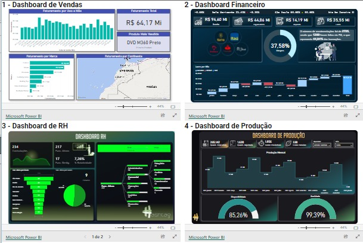

 

## 📊 Portfólio Power BI
Dashboards apresentados:
- [ ] Vendas
- [ ] Produção
- [ ] RH
- [ ] Financeiro

## 🚀 Tecnologias

    

  <small> Desenvolvido por Alexandre Rodrigues • Julho 2023</small>

   

